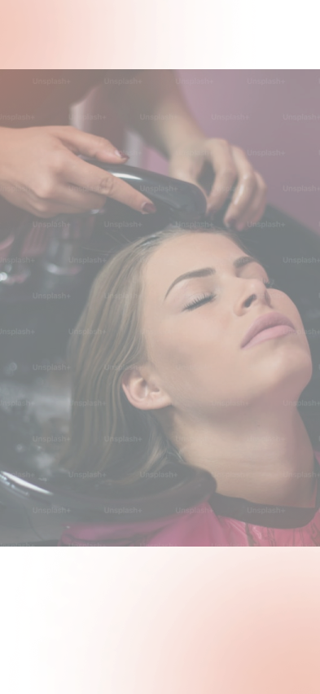
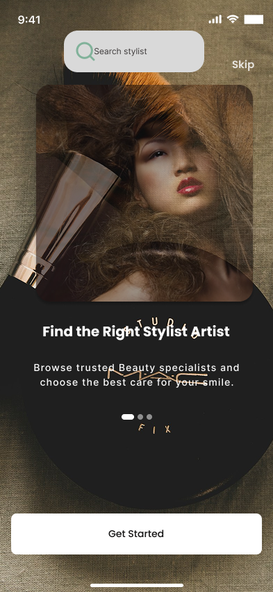
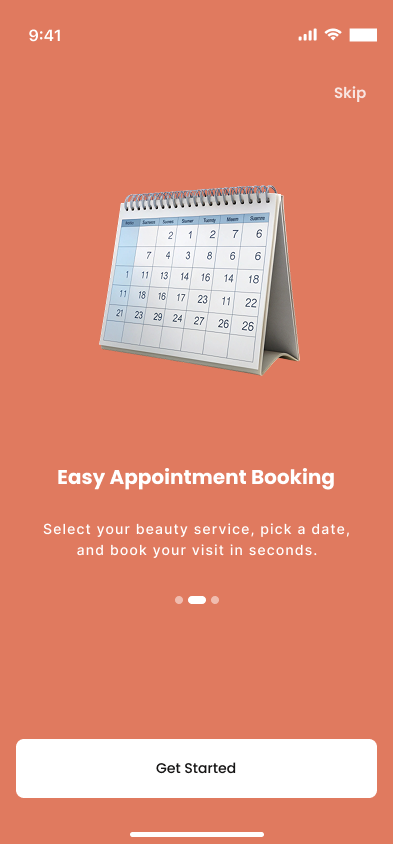
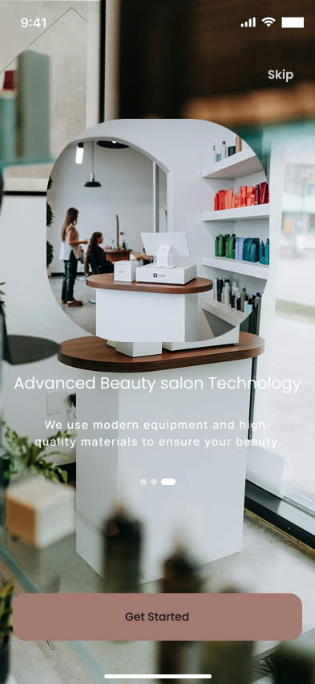
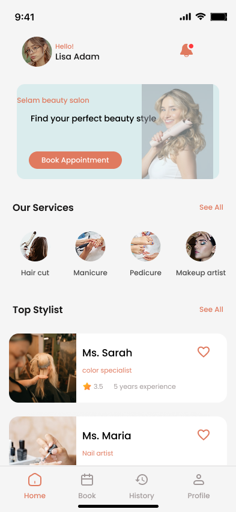
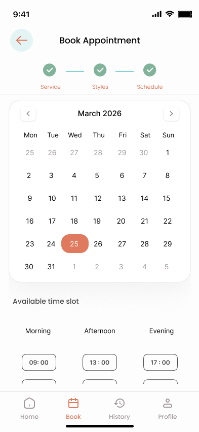
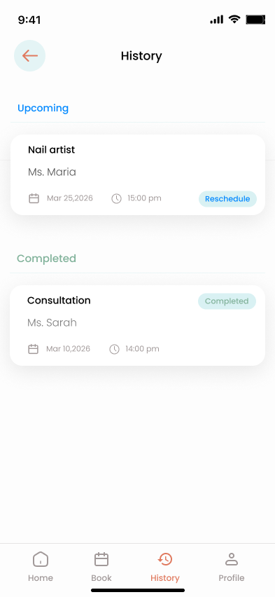
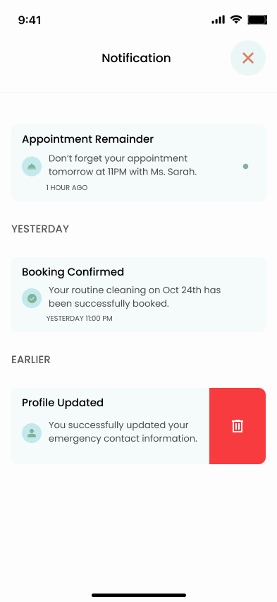
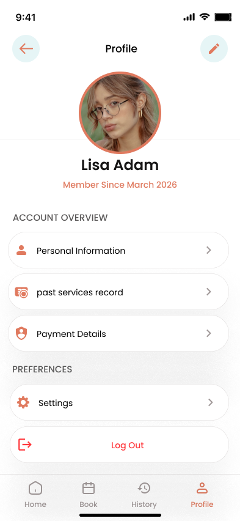

# FUTURE_UX_02
# 💇‍♀️ Selam Beauty Salon – Appointment Booking Mobile App UI
## 👉 See the Figma file: 
[View Design](https://www.figma.com/design/5fjbbL4WlkSVPK80NESaGw/Selam-Beauty-Salon-%E2%80%93-Appointment-App?node-id=0-1&t=y9P4MYADRZo0nwgY-1)

## 🚀 Live Demo

## 📌 Project Overview
This project is a **mobile-first UI/UX design** for an appointment booking app created for a real local business: **Selam Beauty Salon**.

The app solves common problems in traditional booking systems such as:

- Missed appointments  
- Scheduling conflicts  
- Poor customer experience  
- Manual booking inefficiencies  

The goal is to provide a **simple, fast, and user-friendly mobile experience** that allows customers to book services and helps the business manage appointments efficiently.

---

## 🎯 Objective
To design a **high-quality mobile booking experience** that:

- Is easy for first-time users  
- Minimizes booking friction  
- Works smoothly on mobile devices  
- Feels modern, clean, and trustworthy  
- Improves overall customer experience  

---

## 👥 Target Users

- Customers looking for beauty services (hair, nails, facial, makeup)
- Busy individuals who prefer quick online booking
- Mobile-first users
- Returning customers who want to rebook easily

---

## 🧠 UX Strategy & Approach

### 1. Simplified Booking Flow
- Step-by-step process:
  **Service → Stylist → Date & Time → Confirmation**
- Reduces confusion and improves completion rate

---

### 2. Mobile-First Design
- Optimized for small screens
- Touch-friendly buttons and spacing
- Bottom navigation for easy access

---

### 3. Clear Visual Hierarchy
- Important actions (CTA) are highlighted
- Cards and sections improve readability
- Minimal clutter for better focus

---

### 4. User-Friendly Navigation
- Bottom tab navigation:
  - Home
  - Book
  - History
  - Profile
- Easy back flow between screens

---

### 5. Trust & Engagement
- Stylist profiles with ratings and experience
- Booking confirmation feedback
- Notifications and reminders

---

### 6. Reduced Friction
- Quick sign up / login
- Predefined time slots
- Simple selection system

---

## 📱 Key Features & Screens

### 🚀 Onboarding
- Introduces app features
- Guides new users into the system

---

### 🔐 Authentication
- Sign Up & Sign In screens
- Option to continue with Google

---

### 🏠 Home Screen
- Personalized greeting
- Featured services
- Top stylists
- Quick booking CTA

---

### 💅 Service Selection
- Categories (Hair, Nails, Facial, etc.)
- Service cards with price & duration

---

### 👩‍🎨 Stylist Selection
- List of available stylists
- Ratings and experience shown
- Easy selection UI

---

### 📅 Date & Time Booking
- Calendar-based date picker
- Time slot selection (Morning, Afternoon, Evening)

---

### ✅ Booking Confirmation
- Clear confirmation message
- Option to go home or view history

---

### 📜 Booking History
- Upcoming & completed appointments
- Reschedule option

---

### 🔔 Notifications
- Appointment reminders
- Booking updates

---

### 👤 Profile
- Personal info
- Payment details
- Settings and logout

---

## 🛠️ Tools Used

- **Figma** – UI/UX Design  
- **Google Fonts** – Typography  
- **Coolors** – Color palette inspiration  

---

## 🎨 Design Highlights

- Clean and modern UI
- Warm color palette (salon-friendly tones)
- Card-based layout for easy scanning
- Consistent spacing and typography
- Mobile usability focus

## 📸 Screenshots

### Onboarding
  
  
  
  

---

### Authentication
  
  

---

### Home Screen
  

---

### Service Selection
  
  
  

---

### Stylist Selection
  
.png)  
.png)  
.png)  
.png)  

---

### Date & Time Selection
  

---

### Booking Confirmation
  

---

### History
  

---

### Notifications
  

---

### Profile
  

---

## 📂 Project Structure

